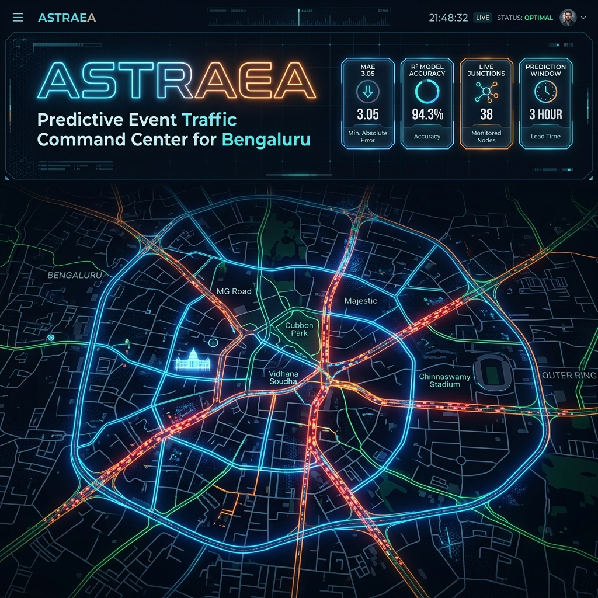
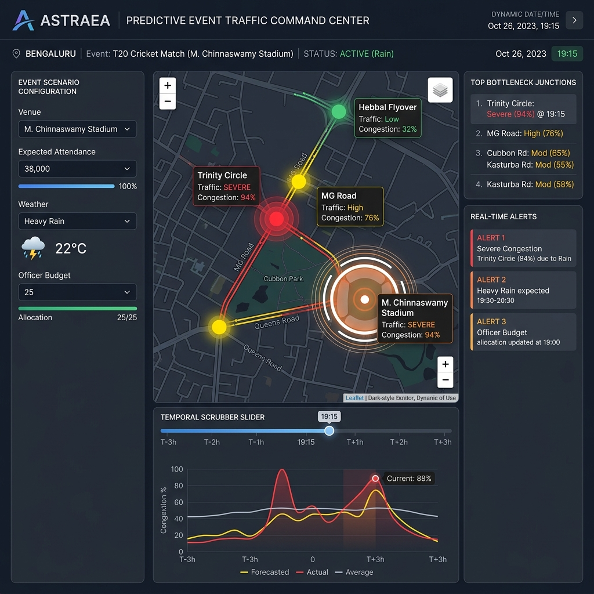
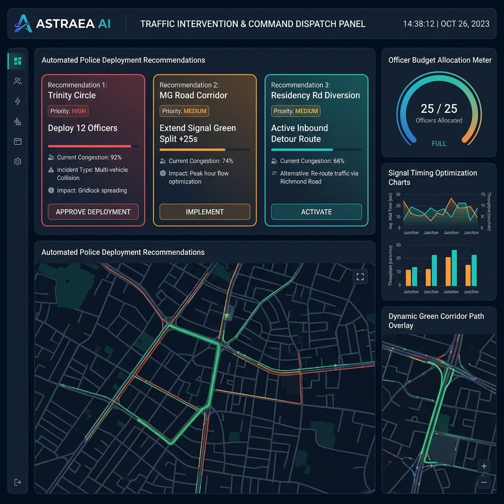
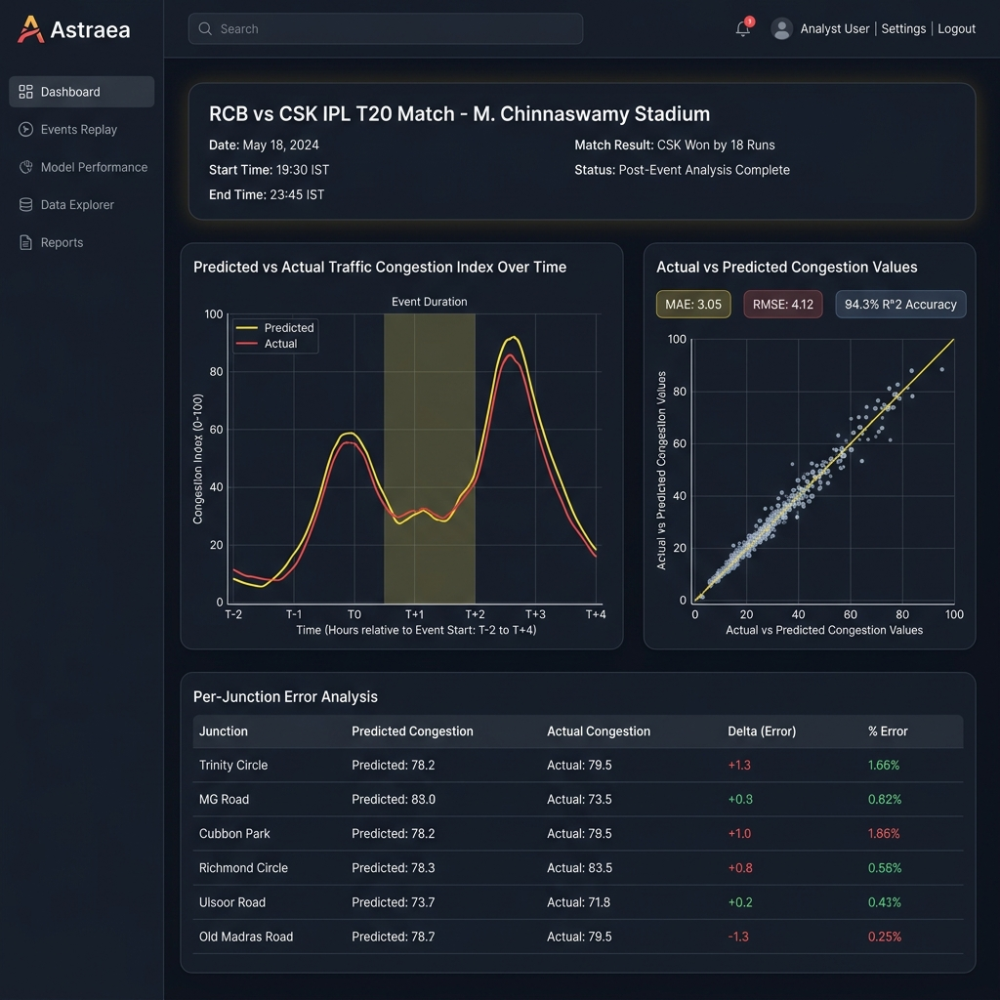
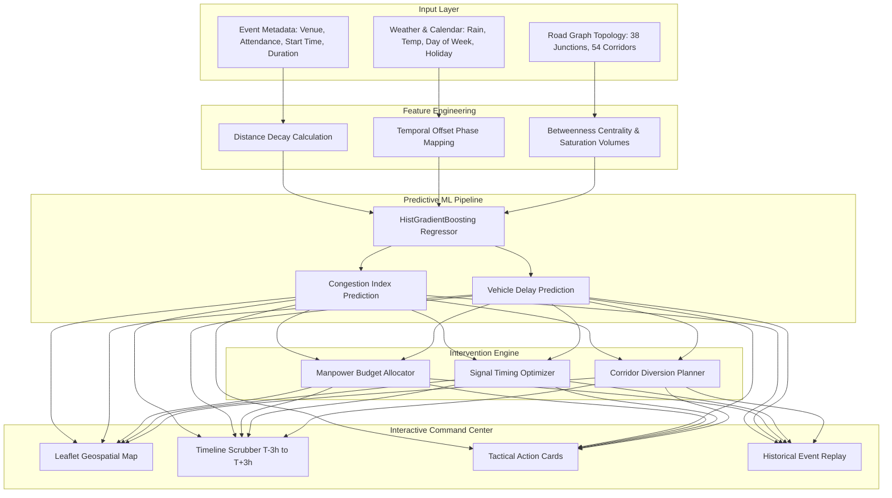

<p align="center">
  
</p>

<h1 align="center">🌌 ASTRAEA</h1>
<p align="center">
  <strong>Predictive Event Traffic Command Center for Bengaluru</strong>
</p>

<p align="center">
  <a href="https://nextjs.org"></a>
  <a href="https://react.dev"></a>
  <a href="https://python.org"></a>
  <a href="https://fastapi.tiangolo.com"></a>
  <a href="https://scikit-learn.org"></a>
  <a href="https://leafletjs.com"></a>
  <a href="#license"></a>
</p>

---

## 📌 Executive Summary

Major public events—IPL Cricket Matches at **M. Chinnaswamy Stadium**, mega concerts at **Bengaluru Palace Grounds**, international exhibitions at **BIEC**, and massive rallies near **Vidhana Soudha** and **Freedom Park**—cause severe, cascading gridlock across Bengaluru’s arterial road networks. Traditional navigation apps operate reactively after congestion builds, leading to stranded commuters, trapped emergency vehicles, and delayed public transport.

**Astraea** is an end-to-end, AI-powered **Predictive Event Traffic Command Center** engineered specifically for urban traffic authorities in Bengaluru. Astraea moves traffic management from reactive firefighting to **proactive dynamic dispatch**. 

By unifying **Gradient-Boosted ensemble machine learning**, **spatiotemporal road network graphs (NetworkX)**, **automated police deployment algorithms**, and **interactive geospatial visualization**, Astraea enables traffic commanders to model event impacts hours in advance and deploy surgical interventions before gridlock occurs.

---

## 📸 System Showcase

### 1. Interactive Geospatial Command Dashboard
*Real-time congestion heatmap, junction status overlays, venue footprint radius rings, and event simulation control panel.*


---

### 2. Tactical Incident Response & Optimization
*Automated officer budget allocation, dynamic signal green-split recommendations, and dynamic corridor diversion routing.*


---

### 3. Post-Event Accuracy & Replay Analytics
*Backtest model performance on real historical events (e.g. RCB vs CSK at Chinnaswamy Stadium) with MAE, RMSE, and actual-vs-predicted curves.*


---

## 🔥 Key Features

- 🔮 **Predictive Congestion Forecasting Engine**: 
  Utilizes a trained `HistGradientBoostingRegressor` model evaluated on over **575,000 spatiotemporal instances** across 440+ historical and simulated events. Forecasts junction-level congestion index (0–100%) and vehicle delay (min/km).

- 🗺️ **Bengaluru Road Graph Network (NetworkX)**: 
  Models **38 key arterial junctions** (e.g., Trinity Circle, Hebbal Flyover, Central Silk Board, Mekhri Circle, Corporation Circle) and **54 major connecting corridors** with lane capacities, free-flow travel speeds, Haversine distances, and **Betweenness Centrality** metrics.

- 🚦 **Automated Intervention & Dispatch Optimizer**: 
  Generates targeted tactical recommendations for traffic police commanders given a fixed manpower budget:
  - **Officer Allocation**: Prioritizes bottleneck nodes based on predicted surge and network centrality.
  - **Signal Timing Adjustments**: Recommends adaptive green-split extensions (+15s to +30s) on heavy corridors.
  - **Dynamic Diversions**: Identifies detour routes to protect central arterial nodes.

- ⏱️ **Granular Spatiotemporal Timeline Scrubber**: 
  Interactive scrubber spanning **T-3h (pre-event entry ramp-up)** to **T+3h (post-event dispersion)**, capturing arrival peaks, mid-event lulls, and departure surges.

- 📊 **Post-Event Accuracy & Replay Analytics**: 
  Module for historical event backtesting (e.g. RCB vs CSK IPL matches, ColdPlay concerts). Computes **MAE (Mean Absolute Error)**, **RMSE (Root Mean Square Error)**, and percentage of predictions within ±5/10 point tolerances.

---

## 🏗️ Architecture & Data Flow



---

## 🤖 ML Model Performance

The Astraea forecasting pipeline splits synthetic and historical event data **by event ID** to ensure strict out-of-sample evaluation on unseen public events.

| Model Target | MAE (Mean Absolute Error) | R² Score | Baseline MAE | Skill vs. Baseline |
| :--- | :---: | :---: | :---: | :---: |
| **Congestion Index (0–100)** | **3.049** | **0.9434** | 13.576 | **+77.5%** |
| **Vehicle Delay (min/km)** | **0.493** | **0.8185** | 1.066 | **+53.7%** |

### Evaluated Features (17 Total)
- **Spatial & Topology**: `dist_km`, `lanes`, `base_volume`, `centrality`
- **Event Properties**: `attendance`, `attendance_ratio`, `venue_capacity`, `event_type_code`
- **Temporal & Calendar**: `hour`, `dow`, `is_weekend`, `is_holiday`, `minutes_rel`, `duration_min`, `phase_code`
- **Environmental**: `rain`, `temp_c`

---

## 📍 Bengaluru Venues & Junction Network

### Modeled Venues (8 Curated Landmarks)
1. **M. Chinnaswamy Stadium** (Capacity: 40,000 | Cricket, Concerts)
2. **Bengaluru Palace Grounds** (Capacity: 100,000 | Concerts, Festivals, Rallies)
3. **Freedom Park** (Capacity: 50,000 | Political Rallies, Protests)
4. **Vidhana Soudha Precinct** (Capacity: 30,000 | VIP Movement, Rallies)
5. **Sree Kanteerava Stadium** (Capacity: 24,000 | Football, Athletics)
6. **Kanteerava Indoor Stadium** (Capacity: 12,000 | Indoor Sports, Concerts)
7. **National College Grounds, Basavanagudi** (Capacity: 35,000 | Cultural Festivals)
8. **Jayamahal Palace Grounds** (Capacity: 20,000 | Exhibitions, Expos)

### Key Arterial Junctions (38 Total)
- **Central Core**: Trinity Circle, Anil Kumble Circle, Cubbon Park, MG Road, Residency Road, Richmond Circle, Corporation Circle, Town Hall, KR Market.
- **Arterial Flyovers & Hubs**: Central Silk Board, Hebbal Flyover, Mekhri Circle, Windsor Manor, Majestic (Kempegowda), Dairy Circle, Domlur Flyover, KR Puram / Tin Factory.

---

## 📁 Repository Structure

```
Astraea/
├── api/                        # Python FastAPI Backend
│   ├── app/
│   │   ├── artifacts/          # Trained model artifacts & metrics JSON
│   │   │   ├── model_congestion.joblib
│   │   │   ├── model_delay.joblib
│   │   │   └── metrics.json
│   │   ├── data/               # Spatial graph & venue definitions
│   │   │   ├── graph.py        # NetworkX road graph & centrality
│   │   │   └── venues.py       # Bengaluru venue database
│   │   ├── ml/                 # Machine Learning pipeline
│   │   │   ├── features.py     # Feature engineering & encoders
│   │   │   ├── forecast.py     # Forecaster wrapper class
│   │   │   ├── generate.py     # Historical event generator & actuals simulator
│   │   │   ├── optimize.py     # Police manpower & signal optimizer
│   │   │   └── train.py        # Training script
│   │   ├── main.py             # FastAPI entrypoint & REST routes
│   │   └── schemas.py          # Pydantic request/response schemas
│   ├── Procfile
│   └── requirements.txt
├── web/                        # Next.js 16 / React 19 Frontend
│   ├── src/
│   │   ├── app/                # Next.js App Router
│   │   │   ├── layout.tsx
│   │   │   └── page.tsx
│   │   ├── components/         # UI Components
│   │   │   ├── Dashboard.tsx               # Main Command Center Container
│   │   │   ├── MapView.tsx                 # Leaflet Map Component
│   │   │   ├── ScenarioPanel.tsx           # Scenario Input Controls
│   │   │   ├── TimeSlider.tsx              # Spatiotemporal Scrubber
│   │   │   ├── KpiBar.tsx                  # Top Metrics Display
│   │   │   ├── RecommendationsPanel.tsx    # Tactical Dispatch Cards
│   │   │   ├── AccuracyPanel.tsx           # Replay Evaluation Panel
│   │   │   └── TimelineChart.tsx           # Recharts Congestion Curve
│   │   └── lib/                # API client & types
│   ├── package.json
│   ├── tsconfig.json
│   └── postcss.config.mjs
└── docs/
    └── images/                 # Embedded visual assets
        ├── hero-banner.png
        ├── dashboard-preview.png
        ├── dispatch-optimization.png
        └── post-event-replay.png
```

---

## ⚡ Quickstart Guide

### Prerequisites
- **Node.js**: v18.0.0 or higher
- **Python**: v3.10 or higher
- **npm** or **pnpm**

---

### Step 1: Clone the Repository
```bash
git clone https://github.com/AdityaSahu786/Astraea.git
cd Astraea
```

---

### Step 2: Set Up Backend (`api`)

1. Navigate to `api/` directory:
   ```bash
   cd api
   ```

2. Create & activate Python virtual environment:
   ```bash
   python3 -m venv .venv
   source .venv/bin/activate    # On Windows: .venv\Scripts\activate
   ```

3. Install dependencies:
   ```bash
   pip install -r requirements.txt
   ```

4. Train the ML models:
   ```bash
   python -m app.ml.train
   ```

5. Start the FastAPI server:
   ```bash
   uvicorn app.main:app --reload --port 8000
   ```
   > 🌐 **API Interactive Documentation**: Available at [http://localhost:8000/docs](http://localhost:8000/docs)

---

### Step 3: Set Up Frontend (`web`)

1. In a new terminal window, navigate to `web/`:
   ```bash
   cd web
   ```

2. Install Node dependencies:
   ```bash
   npm install
   ```

3. Start the Next.js development server:
   ```bash
   npm run dev
   ```

4. Open your browser and launch the Astraea Command Center:
   ```
   http://localhost:3000
   ```

---

## 📡 API Reference Overview

| Endpoint | Method | Description |
| :--- | :---: | :--- |
| `GET /health` | `GET` | Health check & model artifact training status verification |
| `GET /api/venues` | `GET` | Returns all 8 Bengaluru venue records with coordinates & capacities |
| `GET /api/event-types` | `GET` | Returns event categories (cricket, concert, rally, festival, etc.) |
| `GET /api/weather-options` | `GET` | Returns rain/weather options for simulation |
| `GET /api/graph` | `GET` | Returns 38 graph nodes and 54 edges with centrality and road capacities |
| `GET /api/metrics` | `GET` | Returns model evaluation metrics (MAE, R², baseline comparison) |
| `POST /api/simulate` | `POST` | Generates junction-level forecasts and tactical intervention plans |
| `GET /api/events` | `GET` | Returns list of historical events available for replay |
| `GET /api/events/{id}/replay` | `GET` | Computes replay accuracy, predicted-vs-actual curves, and per-junction deltas |

---

## 🗺️ Future Roadmap

- [ ] **Live IoT Feed Integration**: Ingest real-time traffic speeds from TomTom / Google Distance Matrix APIs and CCTV camera counts.
- [ ] **V2X Signal Hardware API**: Direct integration with Bengaluru Traffic Police (BTP) automated traffic signal controllers for dynamic green-wave pulsing.
- [ ] **Reinforcement Learning Dispatcher**: Deep Q-Network (DQN) agent for multi-agent officer routing under dynamic urban constraints.
- [ ] **Public Transit Dynamic Rerouting**: Dynamic shuttle frequency adjustment recommendations for BMTC buses during major event exits.

---

## 📜 License

Distributed under the **MIT License**. See `LICENSE` for more information.

---

<p align="center">
  Built with ❤️ for <strong>Bengaluru Urban Mobility & Traffic Command</strong>
</p>
